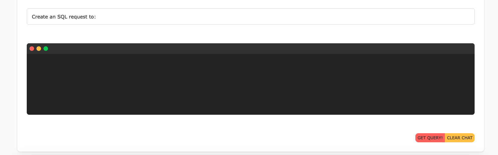

# Getting Started with ChatGPT - SQL Generator App

## Available Scripts

In the project directory, you can run:

### `npm start:frontend`

Runs the app in the development mode.\
Open [http://localhost:3000](http://localhost:3000) to view it in the browser.

The page will reload if you make edits.\
You will also see any lint errors in the console.

### `npm start:backend`

Start the backend of the app at local port 8000

